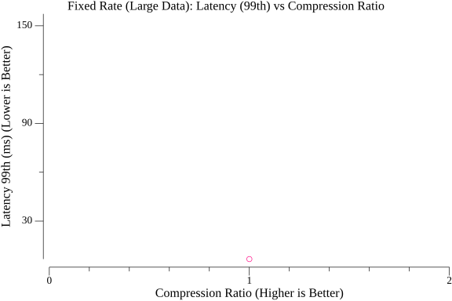
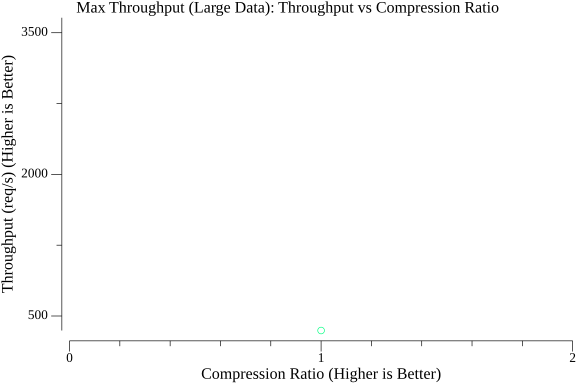

# 圧縮ベンチマークレポート

このレポートは、圧縮されたコンテンツを提供するGoサーバーに対してVegetaを使用して実行された負荷テストの結果をまとめたものです。

## テスト設定

- **負荷生成ツール:** Vegeta
- **ターゲットサーバー:** Go HTTPサーバー (`cmd/server/main.go`)
- **テストデータ:**
    - 小: `testdata/small.txt` (516バイト)
    - 中: `testdata/medium.txt` (30527バイト)
    - 大: `testdata/large.txt` (1068445バイト)
- **テストされた圧縮アルゴリズム:** なし、Gzip (speed, default, best)、Brotli (1, 6, 11)、Zstd (fastest, default, best)
- **テストタイプ:**
    - **固定:** 一定のリクエストレート（`run_vegeta_tests.sh`に基づくとおそらく50 req/s）を一定期間維持。安定した負荷下でのレイテンシを測定。
    - **最大:** 持続可能な最大スループットを見つける試み。サーバーのキャパシティを測定。

## アルゴリズムごとの詳細結果

### なし

#### レベル: N/A

##### データサイズ: small (516 バイト)

**固定レートテスト (レイテンシ重視):**

- **リクエスト数:** 750
- **目標レート:** ~50 req/s (推定)
- **実際のスループット:** 50.06 req/s
- **期間:** 0.00s
- **成功率:** 100.00%
- **レイテンシ (ms):** 平均=0.52, 50パーセンタイル=0.37, 95パーセンタイル=1.13, 99パーセンタイル=3.79
- **圧縮後サイズ (概算):** 516 バイト
- **圧縮率 (概算):** 1.00x
- **ステータスコード:** 200:750
- **エラー:** Vegeta エラー:

**最大スループットテスト (キャパシティ重視):**

- **リクエスト数:** 960828
- **最大スループット:** 64054.76 req/s
- **期間:** 0.00s
- **成功率:** 100.00%
- **最大レート時のレイテンシ (ms):** 平均=0.34, 50パーセンタイル=0.17, 95パーセンタイル=1.16, 99パーセンタイル=1.98
- **圧縮後サイズ (概算):** 516 バイト
- **圧縮率 (概算):** 1.00x
- **ステータスコード:** 200:960828
- **エラー:** Vegeta エラー:

##### データサイズ: medium (30527 バイト)

**固定レートテスト (レイテンシ重視):**

- **リクエスト数:** 750
- **目標レート:** ~50 req/s (推定)
- **実際のスループット:** 50.06 req/s
- **期間:** 0.00s
- **成功率:** 100.00%
- **レイテンシ (ms):** 平均=0.67, 50パーセンタイル=0.49, 95パーセンタイル=2.16, 99パーセンタイル=3.79
- **圧縮後サイズ (概算):** 30527 バイト
- **圧縮率 (概算):** 1.00x
- **ステータスコード:** 200:750
- **エラー:** Vegeta エラー:

**最大スループットテスト (キャパシティ重視):**

- **リクエスト数:** 128840
- **最大スループット:** 8302.03 req/s
- **期間:** 0.00s
- **成功率:** 100.00%
- **最大レート時のレイテンシ (ms):** 平均=2.30, 50パーセンタイル=2.13, 95パーセンタイル=4.93, 99パーセンタイル=6.84
- **圧縮後サイズ (概算):** 30527 バイト
- **圧縮率 (概算):** 1.00x
- **ステータスコード:** 200:128840
- **エラー:** Vegeta エラー:

##### データサイズ: large (1068445 バイト)

**固定レートテスト (レイテンシ重視):**

- **リクエスト数:** 750
- **目標レート:** ~50 req/s (推定)
- **実際のスループット:** 50.06 req/s
- **期間:** 0.00s
- **成功率:** 100.00%
- **レイテンシ (ms):** 平均=2.13, 50パーセンタイル=1.94, 95パーセンタイル=3.90, 99パーセンタイル=6.64
- **圧縮後サイズ (概算):** 1068445 バイト
- **圧縮率 (概算):** 1.00x
- **ステータスコード:** 200:750
- **エラー:** Vegeta エラー:

**最大スループットテスト (キャパシティ重視):**

- **リクエスト数:** 5358
- **最大スループット:** 346.34 req/s
- **期間:** 0.00s
- **成功率:** 99.94%
- **最大レート時のレイテンシ (ms):** 平均=1.87, 50パーセンタイル=1.03, 95パーセンタイル=2.42, 99パーセンタイル=37.30
- **圧縮後サイズ (概算):** 1068445 バイト
- **圧縮率 (概算):** 1.00x
- **ステータスコード:** 0:3 200:5355
- **エラー:** Vegeta エラー: unexpected EOF

### Gzip

#### レベル: speed

##### データサイズ: small (516 バイト)

**固定レートテスト (レイテンシ重視):**

- **リクエスト数:** 750
- **目標レート:** ~50 req/s (推定)
- **実際のスループット:** 50.06 req/s
- **期間:** 0.00s
- **成功率:** 100.00%
- **レイテンシ (ms):** 平均=1.02, 50パーセンタイル=0.77, 95パーセンタイル=2.97, 99パーセンタイル=5.17
- **圧縮後サイズ (概算):** 0 バイト
- **圧縮率 (概算):** 0.00x
- **ステータスコード:** 200:750
- **エラー:** Vegeta エラー:

**最大スループットテスト (キャパシティ重視):**

- **リクエスト数:** 213089
- **最大スループット:** 14203.22 req/s
- **期間:** 0.00s
- **成功率:** 100.00%
- **最大レート時のレイテンシ (ms):** 平均=3.39, 50パーセンタイル=2.49, 95パーセンタイル=9.46, 99パーセンタイル=14.72
- **圧縮後サイズ (概算):** 0 バイト
- **圧縮率 (概算):** 0.00x
- **ステータスコード:** 200:213089
- **エラー:** Vegeta エラー:

##### データサイズ: medium (30527 バイト)

**固定レートテスト (レイテンシ重視):**

- **リクエスト数:** 750
- **目標レート:** ~50 req/s (推定)
- **実際のスループット:** 50.05 req/s
- **期間:** 0.00s
- **成功率:** 100.00%
- **レイテンシ (ms):** 平均=2.29, 50パーセンタイル=1.63, 95パーセンタイル=4.59, 99パーセンタイル=17.56
- **圧縮後サイズ (概算):** 0 バイト
- **圧縮率 (概算):** 0.00x
- **ステータスコード:** 200:750
- **エラー:** Vegeta エラー:

**最大スループットテスト (キャパシティ重視):**

- **リクエスト数:** 73129
- **最大スループット:** 4872.48 req/s
- **期間:** 0.00s
- **成功率:** 100.00%
- **最大レート時のレイテンシ (ms):** 平均=9.53, 50パーセンタイル=8.49, 95パーセンタイル=20.46, 99パーセンタイル=30.72
- **圧縮後サイズ (概算):** 0 バイト
- **圧縮率 (概算):** 0.00x
- **ステータスコード:** 200:73129
- **エラー:** Vegeta エラー:

##### データサイズ: large (1068445 バイト)

**固定レートテスト (レイテンシ重視):**

- **リクエスト数:** 750
- **目標レート:** ~50 req/s (推定)
- **実際のスループット:** 50.04 req/s
- **期間:** 0.00s
- **成功率:** 100.00%
- **レイテンシ (ms):** 平均=7.48, 50パーセンタイル=6.58, 95パーセンタイル=8.89, 99パーセンタイル=36.37
- **圧縮後サイズ (概算):** 0 バイト
- **圧縮率 (概算):** 0.00x
- **ステータスコード:** 200:750
- **エラー:** Vegeta エラー:

**最大スループットテスト (キャパシティ重視):**

- **リクエスト数:** 5594
- **最大スループット:** 355.71 req/s
- **期間:** 0.00s
- **成功率:** 100.00%
- **最大レート時のレイテンシ (ms):** 平均=77.21, 50パーセンタイル=26.90, 95パーセンタイル=300.62, 99パーセンタイル=520.24
- **圧縮後サイズ (概算):** 0 バイト
- **圧縮率 (概算):** 0.00x
- **ステータスコード:** 200:5594
- **エラー:** Vegeta エラー:

#### レベル: default

##### データサイズ: small (516 バイト)

**固定レートテスト (レイテンシ重視):**

- **リクエスト数:** 750
- **目標レート:** ~50 req/s (推定)
- **実際のスループット:** 50.06 req/s
- **期間:** 0.00s
- **成功率:** 100.00%
- **レイテンシ (ms):** 平均=1.10, 50パーセンタイル=0.89, 95パーセンタイル=2.33, 99パーセンタイル=4.31
- **圧縮後サイズ (概算):** 0 バイト
- **圧縮率 (概算):** 0.00x
- **ステータスコード:** 200:750
- **エラー:** Vegeta エラー:

**最大スループットテスト (キャパシティ重視):**

- **リクエスト数:** 224107
- **最大スループット:** 14937.81 req/s
- **期間:** 0.00s
- **成功率:** 100.00%
- **最大レート時のレイテンシ (ms):** 平均=3.16, 50パーセンタイル=2.32, 95パーセンタイル=8.54, 99パーセンタイル=13.77
- **圧縮後サイズ (概算):** 0 バイト
- **圧縮率 (概算):** 0.00x
- **ステータスコード:** 200:224107
- **エラー:** Vegeta エラー:

##### データサイズ: medium (30527 バイト)

**固定レートテスト (レイテンシ重視):**

- **リクエスト数:** 750
- **目標レート:** ~50 req/s (推定)
- **実際のスループット:** 50.05 req/s
- **期間:** 0.00s
- **成功率:** 100.00%
- **レイテンシ (ms):** 平均=3.50, 50パーセンタイル=2.97, 95パーセンタイル=6.08, 99パーセンタイル=17.93
- **圧縮後サイズ (概算):** 0 バイト
- **圧縮率 (概算):** 0.00x
- **ステータスコード:** 200:750
- **エラー:** Vegeta エラー:

**最大スループットテスト (キャパシティ重視):**

- **リクエスト数:** 44211
- **最大スループット:** 2945.19 req/s
- **期間:** 0.00s
- **成功率:** 100.00%
- **最大レート時のレイテンシ (ms):** 平均=16.30, 50パーセンタイル=8.72, 95パーセンタイル=52.11, 99パーセンタイル=91.52
- **圧縮後サイズ (概算):** 0 バイト
- **圧縮率 (概算):** 0.00x
- **ステータスコード:** 200:44211
- **エラー:** Vegeta エラー:

##### データサイズ: large (1068445 バイト)

**固定レートテスト (レイテンシ重視):**

- **リクエスト数:** 750
- **目標レート:** ~50 req/s (推定)
- **実際のスループット:** 50.05 req/s
- **期間:** 0.00s
- **成功率:** 100.00%
- **レイテンシ (ms):** 平均=6.54, 50パーセンタイル=5.67, 95パーセンタイル=9.14, 99パーセンタイル=30.84
- **圧縮後サイズ (概算):** 0 バイト
- **圧縮率 (概算):** 0.00x
- **ステータスコード:** 200:750
- **エラー:** Vegeta エラー:

**最大スループットテスト (キャパシティ重視):**

- **リクエスト数:** 5358
- **最大スループット:** 356.19 req/s
- **期間:** 0.00s
- **成功率:** 100.00%
- **最大レート時のレイテンシ (ms):** 平均=80.72, 50パーセンタイル=40.43, 95パーセンタイル=270.36, 99パーセンタイル=483.91
- **圧縮後サイズ (概算):** 0 バイト
- **圧縮率 (概算):** 0.00x
- **ステータスコード:** 200:5358
- **エラー:** Vegeta エラー:

#### レベル: best

##### データサイズ: small (516 バイト)

**固定レートテスト (レイテンシ重視):**

- **リクエスト数:** 750
- **目標レート:** ~50 req/s (推定)
- **実際のスループット:** 50.07 req/s
- **期間:** 0.00s
- **成功率:** 100.00%
- **レイテンシ (ms):** 平均=1.25, 50パーセンタイル=0.71, 95パーセンタイル=3.00, 99パーセンタイル=13.72
- **圧縮後サイズ (概算):** 0 バイト
- **圧縮率 (概算):** 0.00x
- **ステータスコード:** 200:750
- **エラー:** Vegeta エラー:

**最大スループットテスト (キャパシティ重視):**

- **リクエスト数:** 170414
- **最大スループット:** 11359.58 req/s
- **期間:** 0.00s
- **成功率:** 100.00%
- **最大レート時のレイテンシ (ms):** 平均=4.22, 50パーセンタイル=2.45, 95パーセンタイル=11.31, 99パーセンタイル=29.52
- **圧縮後サイズ (概算):** 0 バイト
- **圧縮率 (概算):** 0.00x
- **ステータスコード:** 200:170414
- **エラー:** Vegeta エラー:

##### データサイズ: medium (30527 バイト)

**固定レートテスト (レイテンシ重視):**

- **リクエスト数:** 750
- **目標レート:** ~50 req/s (推定)
- **実際のスループット:** 50.06 req/s
- **期間:** 0.00s
- **成功率:** 100.00%
- **レイテンシ (ms):** 平均=3.26, 50パーセンタイル=2.93, 95パーセンタイル=5.57, 99パーセンタイル=16.21
- **圧縮後サイズ (概算):** 0 バイト
- **圧縮率 (概算):** 0.00x
- **ステータスコード:** 200:750
- **エラー:** Vegeta エラー:

**最大スループットテスト (キャパシティ重視):**

- **リクエスト数:** 45542
- **最大スループット:** 3033.64 req/s
- **期間:** 0.00s
- **成功率:** 100.00%
- **最大レート時のレイテンシ (ms):** 平均=15.97, 50パーセンタイル=8.35, 95パーセンタイル=50.57, 99パーセンタイル=85.73
- **圧縮後サイズ (概算):** 0 バイト
- **圧縮率 (概算):** 0.00x
- **ステータスコード:** 200:45542
- **エラー:** Vegeta エラー:

##### データサイズ: large (1068445 バイト)

**固定レートテスト (レイテンシ重視):**

- **リクエスト数:** 750
- **目標レート:** ~50 req/s (推定)
- **実際のスループット:** 50.05 req/s
- **期間:** 0.00s
- **成功率:** 100.00%
- **レイテンシ (ms):** 平均=7.04, 50パーセンタイル=5.60, 95パーセンタイル=12.01, 99パーセンタイル=41.70
- **圧縮後サイズ (概算):** 0 バイト
- **圧縮率 (概算):** 0.00x
- **ステータスコード:** 200:750
- **エラー:** Vegeta エラー:

**最大スループットテスト (キャパシティ重視):**

- **リクエスト数:** 6843
- **最大スループット:** 454.92 req/s
- **期間:** 0.00s
- **成功率:** 100.00%
- **最大レート時のレイテンシ (ms):** 平均=47.94, 50パーセンタイル=29.83, 95パーセンタイル=143.13, 99パーセンタイル=242.61
- **圧縮後サイズ (概算):** 0 バイト
- **圧縮率 (概算):** 0.00x
- **ステータスコード:** 200:6843
- **エラー:** Vegeta エラー:

### Brotli

#### レベル: 1

##### データサイズ: small (516 バイト)

**固定レートテスト (レイテンシ重視):**

- **リクエスト数:** 750
- **目標レート:** ~50 req/s (推定)
- **実際のスループット:** 50.06 req/s
- **期間:** 0.00s
- **成功率:** 100.00%
- **レイテンシ (ms):** 平均=1.53, 50パーセンタイル=0.55, 95パーセンタイル=1.68, 99パーセンタイル=39.49
- **圧縮後サイズ (概算):** 0 バイト
- **圧縮率 (概算):** 0.00x
- **ステータスコード:** 200:750
- **エラー:** Vegeta エラー:

**最大スループットテスト (キャパシティ重視):**

- **リクエスト数:** 776920
- **最大スループット:** 51789.51 req/s
- **期間:** 0.00s
- **成功率:** 100.00%
- **最大レート時のレイテンシ (ms):** 平均=0.82, 50パーセンタイル=0.42, 95パーセンタイル=2.60, 99パーセンタイル=4.07
- **圧縮後サイズ (概算):** 0 バイト
- **圧縮率 (概算):** 0.00x
- **ステータスコード:** 200:776920
- **エラー:** Vegeta エラー:

##### データサイズ: medium (30527 バイト)

**固定レートテスト (レイテンシ重視):**

- **リクエスト数:** 750
- **目標レート:** ~50 req/s (推定)
- **実際のスループット:** 50.06 req/s
- **期間:** 0.00s
- **成功率:** 100.00%
- **レイテンシ (ms):** 平均=1.79, 50パーセンタイル=1.53, 95パーセンタイル=3.40, 99パーセンタイル=4.95
- **圧縮後サイズ (概算):** 0 バイト
- **圧縮率 (概算):** 0.00x
- **ステータスコード:** 200:750
- **エラー:** Vegeta エラー:

**最大スループットテスト (キャパシティ重視):**

- **リクエスト数:** 129120
- **最大スループット:** 8605.11 req/s
- **期間:** 0.00s
- **成功率:** 100.00%
- **最大レート時のレイテンシ (ms):** 平均=5.54, 50パーセンタイル=2.23, 95パーセンタイル=18.27, 99パーセンタイル=28.63
- **圧縮後サイズ (概算):** 0 バイト
- **圧縮率 (概算):** 0.00x
- **ステータスコード:** 200:129120
- **エラー:** Vegeta エラー:

##### データサイズ: large (1068445 バイト)

**固定レートテスト (レイテンシ重視):**

- **リクエスト数:** 750
- **目標レート:** ~50 req/s (推定)
- **実際のスループット:** 50.06 req/s
- **期間:** 0.00s
- **成功率:** 100.00%
- **レイテンシ (ms):** 平均=5.32, 50パーセンタイル=3.34, 95パーセンタイル=5.11, 99パーセンタイル=99.93
- **圧縮後サイズ (概算):** 0 バイト
- **圧縮率 (概算):** 0.00x
- **ステータスコード:** 200:750
- **エラー:** Vegeta エラー:

**最大スループットテスト (キャパシティ重視):**

- **リクエスト数:** 43393
- **最大スループット:** 2890.43 req/s
- **期間:** 0.00s
- **成功率:** 100.00%
- **最大レート時のレイテンシ (ms):** 平均=16.84, 50パーセンタイル=8.39, 95パーセンタイル=53.25, 99パーセンタイル=79.93
- **圧縮後サイズ (概算):** 0 バイト
- **圧縮率 (概算):** 0.00x
- **ステータスコード:** 200:43393
- **エラー:** Vegeta エラー:

#### レベル: 6

##### データサイズ: small (516 バイト)

**固定レートテスト (レイテンシ重視):**

- **リクエスト数:** 750
- **目標レート:** ~50 req/s (推定)
- **実際のスループット:** 50.06 req/s
- **期間:** 0.00s
- **成功率:** 100.00%
- **レイテンシ (ms):** 平均=1.31, 50パーセンタイル=1.13, 95パーセンタイル=2.71, 99パーセンタイル=4.06
- **圧縮後サイズ (概算):** 0 バイト
- **圧縮率 (概算):** 0.00x
- **ステータスコード:** 200:750
- **エラー:** Vegeta エラー:

**最大スループットテスト (キャパシティ重視):**

- **リクエスト数:** 196762
- **最大スループット:** 13115.07 req/s
- **期間:** 0.00s
- **成功率:** 100.00%
- **最大レート時のレイテンシ (ms):** 平均=3.76, 50パーセンタイル=1.58, 95パーセンタイル=12.22, 99パーセンタイル=20.50
- **圧縮後サイズ (概算):** 0 バイト
- **圧縮率 (概算):** 0.00x
- **ステータスコード:** 200:196762
- **エラー:** Vegeta エラー:

##### データサイズ: medium (30527 バイト)

**固定レートテスト (レイテンシ重視):**

- **リクエスト数:** 750
- **目標レート:** ~50 req/s (推定)
- **実際のスループット:** 50.05 req/s
- **期間:** 0.00s
- **成功率:** 100.00%
- **レイテンシ (ms):** 平均=3.81, 50パーセンタイル=3.73, 95パーセンタイル=5.14, 99パーセンタイル=11.47
- **圧縮後サイズ (概算):** 0 バイト
- **圧縮率 (概算):** 0.00x
- **ステータスコード:** 200:750
- **エラー:** Vegeta エラー:

**最大スループットテスト (キャパシティ重視):**

- **リクエスト数:** 52467
- **最大スループット:** 3495.05 req/s
- **期間:** 0.00s
- **成功率:** 100.00%
- **最大レート時のレイテンシ (ms):** 平均=14.00, 50パーセンタイル=5.06, 95パーセンタイル=48.60, 99パーセンタイル=90.23
- **圧縮後サイズ (概算):** 0 バイト
- **圧縮率 (概算):** 0.00x
- **ステータスコード:** 200:52467
- **エラー:** Vegeta エラー:

##### データサイズ: large (1068445 バイト)

**固定レートテスト (レイテンシ重視):**

- **リクエスト数:** 750
- **目標レート:** ~50 req/s (推定)
- **実際のスループット:** 50.05 req/s
- **期間:** 0.00s
- **成功率:** 100.00%
- **レイテンシ (ms):** 平均=6.32, 50パーセンタイル=6.09, 95パーセンタイル=7.05, 99パーセンタイル=20.66
- **圧縮後サイズ (概算):** 0 バイト
- **圧縮率 (概算):** 0.00x
- **ステータスコード:** 200:750
- **エラー:** Vegeta エラー:

**最大スループットテスト (キャパシティ重視):**

- **リクエスト数:** 16255
- **最大スループット:** 1081.27 req/s
- **期間:** 0.00s
- **成功率:** 100.00%
- **最大レート時のレイテンシ (ms):** 平均=46.04, 50パーセンタイル=15.77, 95パーセンタイル=183.00, 99パーセンタイル=305.77
- **圧縮後サイズ (概算):** 0 バイト
- **圧縮率 (概算):** 0.00x
- **ステータスコード:** 200:16255
- **エラー:** Vegeta エラー:

#### レベル: 11

##### データサイズ: small (516 バイト)

**固定レートテスト (レイテンシ重視):**

- **リクエスト数:** 750
- **目標レート:** ~50 req/s (推定)
- **実際のスループット:** 50.05 req/s
- **期間:** 0.00s
- **成功率:** 100.00%
- **レイテンシ (ms):** 平均=4.53, 50パーセンタイル=3.80, 95パーセンタイル=4.95, 99パーセンタイル=34.56
- **圧縮後サイズ (概算):** 0 バイト
- **圧縮率 (概算):** 0.00x
- **ステータスコード:** 200:750
- **エラー:** Vegeta エラー:

**最大スループットテスト (キャパシティ重視):**

- **リクエスト数:** 22466
- **最大スループット:** 1495.97 req/s
- **期間:** 0.00s
- **成功率:** 100.00%
- **最大レート時のレイテンシ (ms):** 平均=33.27, 50パーセンタイル=9.97, 95パーセンタイル=128.12, 99パーセンタイル=214.54
- **圧縮後サイズ (概算):** 0 バイト
- **圧縮率 (概算):** 0.00x
- **ステータスコード:** 200:22466
- **エラー:** Vegeta エラー:

##### データサイズ: medium (30527 バイト)

**固定レートテスト (レイテンシ重視):**

- **リクエスト数:** 750
- **目標レート:** ~50 req/s (推定)
- **実際のスループット:** 49.95 req/s
- **期間:** 0.00s
- **成功率:** 100.00%
- **レイテンシ (ms):** 平均=40.32, 50パーセンタイル=35.62, 95パーセンタイル=57.09, 99パーセンタイル=144.00
- **圧縮後サイズ (概算):** 0 バイト
- **圧縮率 (概算):** 0.00x
- **ステータスコード:** 200:750
- **エラー:** Vegeta エラー:

**最大スループットテスト (キャパシティ重視):**

- **リクエスト数:** 1675
- **最大スループット:** 109.51 req/s
- **期間:** 0.00s
- **成功率:** 100.00%
- **最大レート時のレイテンシ (ms):** 平均=454.13, 50パーセンタイル=408.60, 95パーセンタイル=867.06, 99パーセンタイル=1326.00
- **圧縮後サイズ (概算):** 0 バイト
- **圧縮率 (概算):** 0.00x
- **ステータスコード:** 200:1675
- **エラー:** Vegeta エラー:

##### データサイズ: large (1068445 バイト)

**固定レートテスト (レイテンシ重視):**

- **リクエスト数:** 750
- **目標レート:** ~50 req/s (推定)
- **実際のスループット:** 49.85 req/s
- **期間:** 0.00s
- **成功率:** 100.00%
- **レイテンシ (ms):** 平均=66.82, 50パーセンタイル=60.96, 95パーセンタイル=99.36, 99パーセンタイル=143.00
- **圧縮後サイズ (概算):** 0 バイト
- **圧縮率 (概算):** 0.00x
- **ステータスコード:** 200:750
- **エラー:** Vegeta エラー:

**最大スループットテスト (キャパシティ重視):**

- **リクエスト数:** 816
- **最大スループット:** 52.34 req/s
- **期間:** 0.00s
- **成功率:** 100.00%
- **最大レート時のレイテンシ (ms):** 平均=945.97, 50パーセンタイル=932.10, 95パーセンタイル=1623.00, 99パーセンタイル=1979.00
- **圧縮後サイズ (概算):** 0 バイト
- **圧縮率 (概算):** 0.00x
- **ステータスコード:** 200:816
- **エラー:** Vegeta エラー:

### Zstd

#### レベル: fastest

##### データサイズ: small (516 バイト)

**固定レートテスト (レイテンシ重視):**

- **リクエスト数:** 750
- **目標レート:** ~50 req/s (推定)
- **実際のスループット:** 50.06 req/s
- **期間:** 0.00s
- **成功率:** 100.00%
- **レイテンシ (ms):** 平均=1.02, 50パーセンタイル=0.66, 95パーセンタイル=2.56, 99パーセンタイル=7.57
- **圧縮後サイズ (概算):** 0 バイト
- **圧縮率 (概算):** 0.00x
- **ステータスコード:** 200:750
- **エラー:** Vegeta エラー:

**最大スループットテスト (キャパシティ重視):**

- **リクエスト数:** 255790
- **最大スループット:** 17050.20 req/s
- **期間:** 0.00s
- **成功率:** 100.00%
- **最大レート時のレイテンシ (ms):** 平均=2.87, 50パーセンタイル=1.39, 95パーセンタイル=9.31, 99パーセンタイル=14.40
- **圧縮後サイズ (概算):** 0 バイト
- **圧縮率 (概算):** 0.00x
- **ステータスコード:** 200:255790
- **エラー:** Vegeta エラー:

##### データサイズ: medium (30527 バイト)

**固定レートテスト (レイテンシ重視):**

- **リクエスト数:** 750
- **目標レート:** ~50 req/s (推定)
- **実際のスループット:** 50.06 req/s
- **期間:** 0.00s
- **成功率:** 100.00%
- **レイテンシ (ms):** 平均=1.56, 50パーセンタイル=1.24, 95パーセンタイル=3.76, 99パーセンタイル=6.27
- **圧縮後サイズ (概算):** 0 バイト
- **圧縮率 (概算):** 0.00x
- **ステータスコード:** 200:750
- **エラー:** Vegeta エラー:

**最大スループットテスト (キャパシティ重視):**

- **リクエスト数:** 106962
- **最大スループット:** 7116.67 req/s
- **期間:** 0.00s
- **成功率:** 100.00%
- **最大レート時のレイテンシ (ms):** 平均=5.73, 50パーセンタイル=2.94, 95パーセンタイル=17.98, 99パーセンタイル=29.04
- **圧縮後サイズ (概算):** 0 バイト
- **圧縮率 (概算):** 0.00x
- **ステータスコード:** 200:106962
- **エラー:** Vegeta エラー:

##### データサイズ: large (1068445 バイト)

**固定レートテスト (レイテンシ重視):**

- **リクエスト数:** 750
- **目標レート:** ~50 req/s (推定)
- **実際のスループット:** 50.06 req/s
- **期間:** 0.00s
- **成功率:** 100.00%
- **レイテンシ (ms):** 平均=3.09, 50パーセンタイル=2.65, 95パーセンタイル=5.66, 99パーセンタイル=9.40
- **圧縮後サイズ (概算):** 0 バイト
- **圧縮率 (概算):** 0.00x
- **ステータスコード:** 200:750
- **エラー:** Vegeta エラー:

**最大スループットテスト (キャパシティ重視):**

- **リクエスト数:** 49936
- **最大スループット:** 3326.33 req/s
- **期間:** 0.00s
- **成功率:** 100.00%
- **最大レート時のレイテンシ (ms):** 平均=14.59, 50パーセンタイル=7.41, 95パーセンタイル=47.68, 99パーセンタイル=76.31
- **圧縮後サイズ (概算):** 0 バイト
- **圧縮率 (概算):** 0.00x
- **ステータスコード:** 200:49936
- **エラー:** Vegeta エラー:

#### レベル: default

##### データサイズ: small (516 バイト)

**固定レートテスト (レイテンシ重視):**

- **リクエスト数:** 750
- **目標レート:** ~50 req/s (推定)
- **実際のスループット:** 50.06 req/s
- **期間:** 0.00s
- **成功率:** 100.00%
- **レイテンシ (ms):** 平均=1.04, 50パーセンタイル=0.78, 95パーセンタイル=2.01, 99パーセンタイル=5.98
- **圧縮後サイズ (概算):** 0 バイト
- **圧縮率 (概算):** 0.00x
- **ステータスコード:** 200:750
- **エラー:** Vegeta エラー:

**最大スループットテスト (キャパシティ重視):**

- **リクエスト数:** 211904
- **最大スループット:** 14124.76 req/s
- **期間:** 0.00s
- **成功率:** 100.00%
- **最大レート時のレイテンシ (ms):** 平均=3.51, 50パーセンタイル=1.70, 95パーセンタイル=11.40, 99パーセンタイル=17.95
- **圧縮後サイズ (概算):** 0 バイト
- **圧縮率 (概算):** 0.00x
- **ステータスコード:** 200:211904
- **エラー:** Vegeta エラー:

##### データサイズ: medium (30527 バイト)

**固定レートテスト (レイテンシ重視):**

- **リクエスト数:** 750
- **目標レート:** ~50 req/s (推定)
- **実際のスループット:** 50.06 req/s
- **期間:** 0.00s
- **成功率:** 100.00%
- **レイテンシ (ms):** 平均=1.87, 50パーセンタイル=1.62, 95パーセンタイル=4.08, 99パーセンタイル=6.51
- **圧縮後サイズ (概算):** 0 バイト
- **圧縮率 (概算):** 0.00x
- **ステータスコード:** 200:750
- **エラー:** Vegeta エラー:

**最大スループットテスト (キャパシティ重視):**

- **リクエスト数:** 81773
- **最大スループット:** 5448.73 req/s
- **期間:** 0.00s
- **成功率:** 100.00%
- **最大レート時のレイテンシ (ms):** 平均=9.10, 50パーセンタイル=3.65, 95パーセンタイル=30.68, 99パーセンタイル=48.99
- **圧縮後サイズ (概算):** 0 バイト
- **圧縮率 (概算):** 0.00x
- **ステータスコード:** 200:81773
- **エラー:** Vegeta エラー:

##### データサイズ: large (1068445 バイト)

**固定レートテスト (レイテンシ重視):**

- **リクエスト数:** 750
- **目標レート:** ~50 req/s (推定)
- **実際のスループット:** 50.06 req/s
- **期間:** 0.00s
- **成功率:** 100.00%
- **レイテンシ (ms):** 平均=2.73, 50パーセンタイル=2.33, 95パーセンタイル=4.84, 99パーセンタイル=8.37
- **圧縮後サイズ (概算):** 0 バイト
- **圧縮率 (概算):** 0.00x
- **ステータスコード:** 200:750
- **エラー:** Vegeta エラー:

**最大スループットテスト (キャパシティ重視):**

- **リクエスト数:** 24386
- **最大スループット:** 1624.17 req/s
- **期間:** 0.00s
- **成功率:** 100.00%
- **最大レート時のレイテンシ (ms):** 平均=30.04, 50パーセンタイル=14.57, 95パーセンタイル=95.81, 99パーセンタイル=164.76
- **圧縮後サイズ (概算):** 0 バイト
- **圧縮率 (概算):** 0.00x
- **ステータスコード:** 200:24386
- **エラー:** Vegeta エラー:

#### レベル: best

##### データサイズ: small (516 バイト)

**固定レートテスト (レイテンシ重視):**

- **リクエスト数:** 750
- **目標レート:** ~50 req/s (推定)
- **実際のスループット:** 50.06 req/s
- **期間:** 0.00s
- **成功率:** 100.00%
- **レイテンシ (ms):** 平均=8.74, 50パーセンタイル=2.28, 95パーセンタイル=10.20, 99パーセンタイル=303.94
- **圧縮後サイズ (概算):** 0 バイト
- **圧縮率 (概算):** 0.00x
- **ステータスコード:** 200:750
- **エラー:** Vegeta エラー:

**最大スループットテスト (キャパシティ重視):**

- **リクエスト数:** 11575
- **最大スループット:** 770.42 req/s
- **期間:** 0.00s
- **成功率:** 100.00%
- **最大レート時のレイテンシ (ms):** 平均=64.78, 50パーセンタイル=27.48, 95パーセンタイル=258.19, 99パーセンタイル=465.38
- **圧縮後サイズ (概算):** 0 バイト
- **圧縮率 (概算):** 0.00x
- **ステータスコード:** 200:11575
- **エラー:** Vegeta エラー:

##### データサイズ: medium (30527 バイト)

**固定レートテスト (レイテンシ重視):**

- **リクエスト数:** 750
- **目標レート:** ~50 req/s (推定)
- **実際のスループット:** 50.05 req/s
- **期間:** 0.00s
- **成功率:** 100.00%
- **レイテンシ (ms):** 平均=4.85, 50パーセンタイル=3.31, 95パーセンタイル=11.66, 99パーセンタイル=42.77
- **圧縮後サイズ (概算):** 0 バイト
- **圧縮率 (概算):** 0.00x
- **ステータスコード:** 200:750
- **エラー:** Vegeta エラー:

**最大スループットテスト (キャパシティ重視):**

- **リクエスト数:** 1982
- **最大スループット:** 130.85 req/s
- **期間:** 0.00s
- **成功率:** 100.00%
- **最大レート時のレイテンシ (ms):** 平均=380.06, 50パーセンタイル=283.39, 95パーセンタイル=1190.00, 99パーセンタイル=1626.00
- **圧縮後サイズ (概算):** 0 バイト
- **圧縮率 (概算):** 0.00x
- **ステータスコード:** 200:1982
- **エラー:** Vegeta エラー:

##### データサイズ: large (1068445 バイト)

**固定レートテスト (レイテンシ重視):**

- **リクエスト数:** 750
- **目標レート:** ~50 req/s (推定)
- **実際のスループット:** 50.04 req/s
- **期間:** 0.00s
- **成功率:** 100.00%
- **レイテンシ (ms):** 平均=7.33, 50パーセンタイル=6.24, 95パーセンタイル=10.32, 99パーセンタイル=44.31
- **圧縮後サイズ (概算):** 0 バイト
- **圧縮率 (概算):** 0.00x
- **ステータスコード:** 200:750
- **エラー:** Vegeta エラー:

**最大スループットテスト (キャパシティ重視):**

- **リクエスト数:** 1030
- **最大スループット:** 66.99 req/s
- **期間:** 0.00s
- **成功率:** 100.00%
- **最大レート時のレイテンシ (ms):** 平均=739.72, 50パーセンタイル=612.31, 95パーセンタイル=1876.00, 99パーセンタイル=2595.00
- **圧縮後サイズ (概算):** 0 バイト
- **圧縮率 (概算):** 0.00x
- **ステータスコード:** 200:1030
- **エラー:** Vegeta エラー:

## 比較概要

### 固定レートテスト (レイテンシ @ ~50 req/s)

| アルゴリズム | レベル    | データサイズ | レイテンシ (99パーセンタイル ms) | スループット (req/s) | 圧縮率 (x) | 圧縮後サイズ (バイト) | 成功率 (%) |
|-----------|----------|-----------|-------------------|--------------------|-----------------|--------------------|-------------|
| brotli | 1 | small |    39.49 |              50.06 |            0.00 |                  0 |      100.00 |
| brotli | 1 | medium |     4.95 |              50.06 |            0.00 |                  0 |      100.00 |
| brotli | 1 | large |    99.93 |              50.06 |            0.00 |                  0 |      100.00 |
| brotli | 6 | small |     4.06 |              50.06 |            0.00 |                  0 |      100.00 |
| brotli | 6 | medium |    11.47 |              50.05 |            0.00 |                  0 |      100.00 |
| brotli | 6 | large |    20.66 |              50.05 |            0.00 |                  0 |      100.00 |
| brotli | 11 | small |    34.56 |              50.05 |            0.00 |                  0 |      100.00 |
| brotli | 11 | medium |   144.00 |              49.95 |            0.00 |                  0 |      100.00 |
| brotli | 11 | large |   143.00 |              49.85 |            0.00 |                  0 |      100.00 |
| gzip | speed | small |     5.17 |              50.06 |            0.00 |                  0 |      100.00 |
| gzip | speed | medium |    17.56 |              50.05 |            0.00 |                  0 |      100.00 |
| gzip | speed | large |    36.37 |              50.04 |            0.00 |                  0 |      100.00 |
| gzip | default | small |     4.31 |              50.06 |            0.00 |                  0 |      100.00 |
| gzip | default | medium |    17.93 |              50.05 |            0.00 |                  0 |      100.00 |
| gzip | default | large |    30.84 |              50.05 |            0.00 |                  0 |      100.00 |
| gzip | best | small |    13.72 |              50.07 |            0.00 |                  0 |      100.00 |
| gzip | best | medium |    16.21 |              50.06 |            0.00 |                  0 |      100.00 |
| gzip | best | large |    41.70 |              50.05 |            0.00 |                  0 |      100.00 |
| none | N/A | small |     3.79 |              50.06 |            1.00 |                516 |      100.00 |
| none | N/A | medium |     3.79 |              50.06 |            1.00 |              30527 |      100.00 |
| none | N/A | large |     6.64 |              50.06 |            1.00 |            1068445 |      100.00 |
| zstd | fastest | small |     7.57 |              50.06 |            0.00 |                  0 |      100.00 |
| zstd | fastest | medium |     6.27 |              50.06 |            0.00 |                  0 |      100.00 |
| zstd | fastest | large |     9.40 |              50.06 |            0.00 |                  0 |      100.00 |
| zstd | default | small |     5.98 |              50.06 |            0.00 |                  0 |      100.00 |
| zstd | default | medium |     6.51 |              50.06 |            0.00 |                  0 |      100.00 |
| zstd | default | large |     8.37 |              50.06 |            0.00 |                  0 |      100.00 |
| zstd | best | small |   303.94 |              50.06 |            0.00 |                  0 |      100.00 |
| zstd | best | medium |    42.77 |              50.05 |            0.00 |                  0 |      100.00 |
| zstd | best | large |    44.31 |              50.04 |            0.00 |                  0 |      100.00 |

### 最大スループットテスト (キャパシティ)

| アルゴリズム | レベル    | データサイズ | 最大スループット (req/s) | レイテンシ (99パーセンタイル ms) | 圧縮率 (x) | 圧縮後サイズ (バイト) | 成功率 (%) |
|-----------|----------|-----------|------------------------|-------------------|-----------------|--------------------|-------------|
| brotli | 1 | small |               51789.51 |              4.07 |            0.00 |                  0 |      100.00 |
| brotli | 1 | medium |                8605.11 |             28.63 |            0.00 |                  0 |      100.00 |
| brotli | 1 | large |                2890.43 |             79.93 |            0.00 |                  0 |      100.00 |
| brotli | 6 | small |               13115.07 |             20.50 |            0.00 |                  0 |      100.00 |
| brotli | 6 | medium |                3495.05 |             90.23 |            0.00 |                  0 |      100.00 |
| brotli | 6 | large |                1081.27 |            305.77 |            0.00 |                  0 |      100.00 |
| brotli | 11 | small |                1495.97 |            214.54 |            0.00 |                  0 |      100.00 |
| brotli | 11 | medium |                 109.51 |           1326.00 |            0.00 |                  0 |      100.00 |
| brotli | 11 | large |                  52.34 |           1979.00 |            0.00 |                  0 |      100.00 |
| gzip | speed | small |               14203.22 |             14.72 |            0.00 |                  0 |      100.00 |
| gzip | speed | medium |                4872.48 |             30.72 |            0.00 |                  0 |      100.00 |
| gzip | speed | large |                 355.71 |            520.24 |            0.00 |                  0 |      100.00 |
| gzip | default | small |               14937.81 |             13.77 |            0.00 |                  0 |      100.00 |
| gzip | default | medium |                2945.19 |             91.52 |            0.00 |                  0 |      100.00 |
| gzip | default | large |                 356.19 |            483.91 |            0.00 |                  0 |      100.00 |
| gzip | best | small |               11359.58 |             29.52 |            0.00 |                  0 |      100.00 |
| gzip | best | medium |                3033.64 |             85.73 |            0.00 |                  0 |      100.00 |
| gzip | best | large |                 454.92 |            242.61 |            0.00 |                  0 |      100.00 |
| none | N/A | small |               64054.76 |              1.98 |            1.00 |                516 |      100.00 |
| none | N/A | medium |                8302.03 |              6.84 |            1.00 |              30527 |      100.00 |
| none | N/A | large |                 346.34 |             37.30 |            1.00 |            1068445 |       99.94 |
| zstd | fastest | small |               17050.20 |             14.40 |            0.00 |                  0 |      100.00 |
| zstd | fastest | medium |                7116.67 |             29.04 |            0.00 |                  0 |      100.00 |
| zstd | fastest | large |                3326.33 |             76.31 |            0.00 |                  0 |      100.00 |
| zstd | default | small |               14124.76 |             17.95 |            0.00 |                  0 |      100.00 |
| zstd | default | medium |                5448.73 |             48.99 |            0.00 |                  0 |      100.00 |
| zstd | default | large |                1624.17 |            164.76 |            0.00 |                  0 |      100.00 |
| zstd | best | small |                 770.42 |            465.38 |            0.00 |                  0 |      100.00 |
| zstd | best | medium |                 130.85 |           1626.00 |            0.00 |                  0 |      100.00 |
| zstd | best | large |                  66.99 |           2595.00 |            0.00 |                  0 |      100.00 |

## パフォーマンスグラフ (Mermaid)

**注意:** Mermaidグラフは、サポートされている環境（GitLab、拡張機能付きGitHubなど）でレンダリングされます。

### 固定レート: 99パーセンタイルレイテンシ vs 圧縮率 (大データ)

### 最大スループット vs 圧縮率 (大データ)

*(必要であれば、中・小データについても同様のグラフをここに追加できます)*

## 結論

結果に基づくと:

- **圧縮率:** Brotli (レベル11) と Zstd (best) は一般的に最も高い圧縮率を提供し、特に大きなペイロードの場合、データサイズを大幅に削減します。Gzip (best) は良好な圧縮を提供し、default/speedレベルよりも優れています。
- **レイテンシ (固定レート):**
    - 圧縮なし ('none') では、帯域幅を犠牲にするものの、レイテンシは一般的に最も低くなります。
    - Gzip (speed)、Brotli (1)、Zstd (fastest) のような高速なアルゴリズムは、'none' と比較して最小限のレイテンシオーバーヘッドしか導入しません。
    - 高い圧縮レベル (Brotli 11, Zstd best, Gzip best) は、圧縮のCPUコストが高いため、レイテンシが増加する傾向があります。ただし、この影響は、クライアント側の解凍中（Vegetaが測定するもの）よりも、サーバー側の圧縮中により顕著になる可能性があります。影響はデータサイズによって異なります。
- **スループット (最大レート):**
    - 'None' は、主にネットワークまたはサーバーの接続処理によって制限され、多くの場合、最も高い生の要求スループットを達成します。
    - 軽量な圧縮 (Gzip speed, Brotli 1, Zstd fastest) は、特に非圧縮データのボトルネックがネットワーク帯域幅である場合、'none' に近いスループットを達成できることがあります。
    - 重い圧縮アルゴリズムは、サーバー上のCPUオーバーヘッドのため、達成可能な最大スループットを大幅に低下させます。Zstdは一般的に良好なバランスを示し、同様の高い圧縮レベルでBrotliよりも優れたスループットを提供します。
- **トレードオフ:**
    - **帯域幅重視:** データ転送の最小化が重要な場合、Brotli (11) または Zstd (best) が有力な選択肢ですが、潜在的なレイテンシ/スループットのペナルティを受け入れます。
    - **レイテンシ重視:** 応答時間の最小化が最優先事項である場合、'none' または非常に軽い圧縮 (Zstd fastest, Brotli 1, Gzip speed) が望ましいです。
    - **バランス:** Zstd (default または best) は、圧縮率、レイテンシ、スループットの間の良好な妥協点を提供することがよくあります。Gzip (default) は、広く互換性があり、妥当なデフォルトとして残ります。

**推奨事項:**

最適な選択は、特定のアプリケーションのニーズ（レイテンシ感度、帯域幅制約、典型的なデータサイズ、クライアントの能力）に大きく依存します。

- 帯域幅の節約が重要で、潜在的に大きく圧縮可能なテキストベースのデータを扱うAPIの場合、**Zstd (default)** は優れたバランスを提供します。
- 最大限の圧縮が望まれ、事前に計算できる静的アセットの場合、**Brotli (11)** が最有力候補です。
- 互換性と適度な圧縮で十分な汎用Webコンテンツの場合、**Gzip (default)** は依然として堅実な選択肢です。
- レイテンシが絶対的に重要で帯域幅が豊富な場合、**'none'** または **Zstd (fastest)** が検討される可能性があります。

さらなる調査として、これらのテスト中にサーバー側のCPU使用率をプロファイリングして、圧縮コストのより明確な全体像を得ることが考えられます。