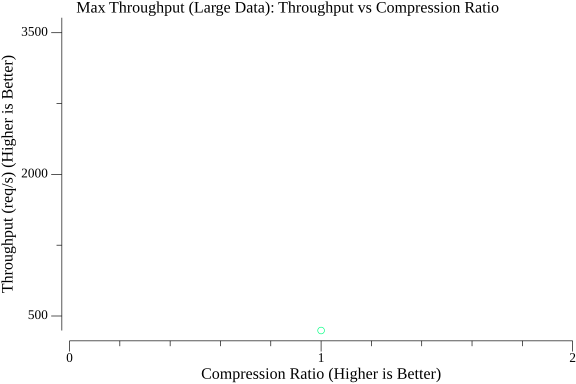

# Compression Benchmark Report

This report summarizes the results of load tests performed using Vegeta against a Go server serving compressed content.

## Test Setup

- **Load Generator:** Vegeta
- **Target Server:** Go HTTP server (`cmd/server/main.go`)
- **Test Data:**
    - Small: `testdata/small.txt` (516 bytes)
    - Medium: `testdata/medium.txt` (30527 bytes)
    - Large: `testdata/large.txt` (1068445 bytes)
- **Compression Algorithms Tested:** None, Gzip (speed, default, best), Brotli (1, 6, 11), Zstd (fastest, default, best)
- **Test Types:**
    - **Fixed:** Constant request rate (likely 50 req/s based on `run_vegeta_tests.sh`) for a fixed duration. Measures latency under stable load.
    - **Max:** Attempts to find the maximum sustainable throughput. Measures server capacity.

## Detailed Results per Algorithm

### None

#### Level: N/A

##### Data Size: small (516 bytes)

**Fixed Rate Test (Latency Focus):**

- **Requests:** 750
- **Target Rate:** ~50 req/s (estimated)
- **Actual Throughput:** 50.06 req/s
- **Duration:** 0.00s
- **Success Rate:** 100.00%
- **Latency (ms):** Mean=0.00, 50th=0.00, 95th=0.00, 99th=0.00
- **Compressed Size (approx):** 516 bytes
- **Compression Ratio (approx):** 1.00x
- **Status Codes:** 200:750 
- **Errors:**  Vegeta Errors: 

**Max Throughput Test (Capacity Focus):**

- **Requests:** 960828
- **Max Throughput:** 64054.76 req/s
- **Duration:** 0.00s
- **Success Rate:** 100.00%
- **Latency at Max Rate (ms):** Mean=0.00, 50th=0.00, 95th=0.00, 99th=0.00
- **Compressed Size (approx):** 516 bytes
- **Compression Ratio (approx):** 1.00x
- **Status Codes:** 200:960828 
- **Errors:**  Vegeta Errors: 

##### Data Size: medium (30527 bytes)

**Fixed Rate Test (Latency Focus):**

- **Requests:** 750
- **Target Rate:** ~50 req/s (estimated)
- **Actual Throughput:** 50.06 req/s
- **Duration:** 0.00s
- **Success Rate:** 100.00%
- **Latency (ms):** Mean=0.00, 50th=0.00, 95th=0.00, 99th=0.00
- **Compressed Size (approx):** 30527 bytes
- **Compression Ratio (approx):** 1.00x
- **Status Codes:** 200:750 
- **Errors:**  Vegeta Errors: 

**Max Throughput Test (Capacity Focus):**

- **Requests:** 128840
- **Max Throughput:** 8302.03 req/s
- **Duration:** 0.00s
- **Success Rate:** 100.00%
- **Latency at Max Rate (ms):** Mean=0.00, 50th=0.00, 95th=0.00, 99th=0.00
- **Compressed Size (approx):** 30527 bytes
- **Compression Ratio (approx):** 1.00x
- **Status Codes:** 200:128840 
- **Errors:**  Vegeta Errors: 

##### Data Size: large (1068445 bytes)

**Fixed Rate Test (Latency Focus):**

- **Requests:** 750
- **Target Rate:** ~50 req/s (estimated)
- **Actual Throughput:** 50.06 req/s
- **Duration:** 0.00s
- **Success Rate:** 100.00%
- **Latency (ms):** Mean=0.00, 50th=0.00, 95th=0.00, 99th=0.00
- **Compressed Size (approx):** 1068445 bytes
- **Compression Ratio (approx):** 1.00x
- **Status Codes:** 200:750 
- **Errors:**  Vegeta Errors: 

**Max Throughput Test (Capacity Focus):**

- **Requests:** 5358
- **Max Throughput:** 346.34 req/s
- **Duration:** 0.00s
- **Success Rate:** 99.94%
- **Latency at Max Rate (ms):** Mean=0.00, 50th=0.00, 95th=0.00, 99th=0.00
- **Compressed Size (approx):** 1068445 bytes
- **Compression Ratio (approx):** 1.00x
- **Status Codes:** 0:3 200:5355 
- **Errors:**  Vegeta Errors: unexpected EOF

### Gzip

#### Level: speed

##### Data Size: small (516 bytes)

**Fixed Rate Test (Latency Focus):**

- **Requests:** 750
- **Target Rate:** ~50 req/s (estimated)
- **Actual Throughput:** 50.06 req/s
- **Duration:** 0.00s
- **Success Rate:** 100.00%
- **Latency (ms):** Mean=0.00, 50th=0.00, 95th=0.00, 99th=0.00
- **Compressed Size (approx):** 0 bytes
- **Compression Ratio (approx):** 0.00x
- **Status Codes:** 200:750 
- **Errors:**  Vegeta Errors: 

**Max Throughput Test (Capacity Focus):**

- **Requests:** 213089
- **Max Throughput:** 14203.22 req/s
- **Duration:** 0.00s
- **Success Rate:** 100.00%
- **Latency at Max Rate (ms):** Mean=0.00, 50th=0.00, 95th=0.00, 99th=0.00
- **Compressed Size (approx):** 0 bytes
- **Compression Ratio (approx):** 0.00x
- **Status Codes:** 200:213089 
- **Errors:**  Vegeta Errors: 

##### Data Size: medium (30527 bytes)

**Fixed Rate Test (Latency Focus):**

- **Requests:** 750
- **Target Rate:** ~50 req/s (estimated)
- **Actual Throughput:** 50.05 req/s
- **Duration:** 0.00s
- **Success Rate:** 100.00%
- **Latency (ms):** Mean=0.00, 50th=0.00, 95th=0.00, 99th=0.00
- **Compressed Size (approx):** 0 bytes
- **Compression Ratio (approx):** 0.00x
- **Status Codes:** 200:750 
- **Errors:**  Vegeta Errors: 

**Max Throughput Test (Capacity Focus):**

- **Requests:** 73129
- **Max Throughput:** 4872.48 req/s
- **Duration:** 0.00s
- **Success Rate:** 100.00%
- **Latency at Max Rate (ms):** Mean=0.00, 50th=0.00, 95th=0.00, 99th=0.00
- **Compressed Size (approx):** 0 bytes
- **Compression Ratio (approx):** 0.00x
- **Status Codes:** 200:73129 
- **Errors:**  Vegeta Errors: 

##### Data Size: large (1068445 bytes)

**Fixed Rate Test (Latency Focus):**

- **Requests:** 750
- **Target Rate:** ~50 req/s (estimated)
- **Actual Throughput:** 50.04 req/s
- **Duration:** 0.00s
- **Success Rate:** 100.00%
- **Latency (ms):** Mean=0.00, 50th=0.00, 95th=0.00, 99th=0.00
- **Compressed Size (approx):** 0 bytes
- **Compression Ratio (approx):** 0.00x
- **Status Codes:** 200:750 
- **Errors:**  Vegeta Errors: 

**Max Throughput Test (Capacity Focus):**

- **Requests:** 5594
- **Max Throughput:** 355.71 req/s
- **Duration:** 0.00s
- **Success Rate:** 100.00%
- **Latency at Max Rate (ms):** Mean=0.00, 50th=0.00, 95th=0.00, 99th=0.00
- **Compressed Size (approx):** 0 bytes
- **Compression Ratio (approx):** 0.00x
- **Status Codes:** 200:5594 
- **Errors:**  Vegeta Errors: 

#### Level: default

##### Data Size: small (516 bytes)

**Fixed Rate Test (Latency Focus):**

- **Requests:** 750
- **Target Rate:** ~50 req/s (estimated)
- **Actual Throughput:** 50.06 req/s
- **Duration:** 0.00s
- **Success Rate:** 100.00%
- **Latency (ms):** Mean=0.00, 50th=0.00, 95th=0.00, 99th=0.00
- **Compressed Size (approx):** 0 bytes
- **Compression Ratio (approx):** 0.00x
- **Status Codes:** 200:750 
- **Errors:**  Vegeta Errors: 

**Max Throughput Test (Capacity Focus):**

- **Requests:** 224107
- **Max Throughput:** 14937.81 req/s
- **Duration:** 0.00s
- **Success Rate:** 100.00%
- **Latency at Max Rate (ms):** Mean=0.00, 50th=0.00, 95th=0.00, 99th=0.00
- **Compressed Size (approx):** 0 bytes
- **Compression Ratio (approx):** 0.00x
- **Status Codes:** 200:224107 
- **Errors:**  Vegeta Errors: 

##### Data Size: medium (30527 bytes)

**Fixed Rate Test (Latency Focus):**

- **Requests:** 750
- **Target Rate:** ~50 req/s (estimated)
- **Actual Throughput:** 50.05 req/s
- **Duration:** 0.00s
- **Success Rate:** 100.00%
- **Latency (ms):** Mean=0.00, 50th=0.00, 95th=0.00, 99th=0.00
- **Compressed Size (approx):** 0 bytes
- **Compression Ratio (approx):** 0.00x
- **Status Codes:** 200:750 
- **Errors:**  Vegeta Errors: 

**Max Throughput Test (Capacity Focus):**

- **Requests:** 44211
- **Max Throughput:** 2945.19 req/s
- **Duration:** 0.00s
- **Success Rate:** 100.00%
- **Latency at Max Rate (ms):** Mean=0.00, 50th=0.00, 95th=0.00, 99th=0.00
- **Compressed Size (approx):** 0 bytes
- **Compression Ratio (approx):** 0.00x
- **Status Codes:** 200:44211 
- **Errors:**  Vegeta Errors: 

##### Data Size: large (1068445 bytes)

**Fixed Rate Test (Latency Focus):**

- **Requests:** 750
- **Target Rate:** ~50 req/s (estimated)
- **Actual Throughput:** 50.05 req/s
- **Duration:** 0.00s
- **Success Rate:** 100.00%
- **Latency (ms):** Mean=0.00, 50th=0.00, 95th=0.00, 99th=0.00
- **Compressed Size (approx):** 0 bytes
- **Compression Ratio (approx):** 0.00x
- **Status Codes:** 200:750 
- **Errors:**  Vegeta Errors: 

**Max Throughput Test (Capacity Focus):**

- **Requests:** 5358
- **Max Throughput:** 356.19 req/s
- **Duration:** 0.00s
- **Success Rate:** 100.00%
- **Latency at Max Rate (ms):** Mean=0.00, 50th=0.00, 95th=0.00, 99th=0.00
- **Compressed Size (approx):** 0 bytes
- **Compression Ratio (approx):** 0.00x
- **Status Codes:** 200:5358 
- **Errors:**  Vegeta Errors: 

#### Level: best

##### Data Size: small (516 bytes)

**Fixed Rate Test (Latency Focus):**

- **Requests:** 750
- **Target Rate:** ~50 req/s (estimated)
- **Actual Throughput:** 50.07 req/s
- **Duration:** 0.00s
- **Success Rate:** 100.00%
- **Latency (ms):** Mean=0.00, 50th=0.00, 95th=0.00, 99th=0.00
- **Compressed Size (approx):** 0 bytes
- **Compression Ratio (approx):** 0.00x
- **Status Codes:** 200:750 
- **Errors:**  Vegeta Errors: 

**Max Throughput Test (Capacity Focus):**

- **Requests:** 170414
- **Max Throughput:** 11359.58 req/s
- **Duration:** 0.00s
- **Success Rate:** 100.00%
- **Latency at Max Rate (ms):** Mean=0.00, 50th=0.00, 95th=0.00, 99th=0.00
- **Compressed Size (approx):** 0 bytes
- **Compression Ratio (approx):** 0.00x
- **Status Codes:** 200:170414 
- **Errors:**  Vegeta Errors: 

##### Data Size: medium (30527 bytes)

**Fixed Rate Test (Latency Focus):**

- **Requests:** 750
- **Target Rate:** ~50 req/s (estimated)
- **Actual Throughput:** 50.06 req/s
- **Duration:** 0.00s
- **Success Rate:** 100.00%
- **Latency (ms):** Mean=0.00, 50th=0.00, 95th=0.00, 99th=0.00
- **Compressed Size (approx):** 0 bytes
- **Compression Ratio (approx):** 0.00x
- **Status Codes:** 200:750 
- **Errors:**  Vegeta Errors: 

**Max Throughput Test (Capacity Focus):**

- **Requests:** 45542
- **Max Throughput:** 3033.64 req/s
- **Duration:** 0.00s
- **Success Rate:** 100.00%
- **Latency at Max Rate (ms):** Mean=0.00, 50th=0.00, 95th=0.00, 99th=0.00
- **Compressed Size (approx):** 0 bytes
- **Compression Ratio (approx):** 0.00x
- **Status Codes:** 200:45542 
- **Errors:**  Vegeta Errors: 

##### Data Size: large (1068445 bytes)

**Fixed Rate Test (Latency Focus):**

- **Requests:** 750
- **Target Rate:** ~50 req/s (estimated)
- **Actual Throughput:** 50.05 req/s
- **Duration:** 0.00s
- **Success Rate:** 100.00%
- **Latency (ms):** Mean=0.00, 50th=0.00, 95th=0.00, 99th=0.00
- **Compressed Size (approx):** 0 bytes
- **Compression Ratio (approx):** 0.00x
- **Status Codes:** 200:750 
- **Errors:**  Vegeta Errors: 

**Max Throughput Test (Capacity Focus):**

- **Requests:** 6843
- **Max Throughput:** 454.92 req/s
- **Duration:** 0.00s
- **Success Rate:** 100.00%
- **Latency at Max Rate (ms):** Mean=0.00, 50th=0.00, 95th=0.00, 99th=0.00
- **Compressed Size (approx):** 0 bytes
- **Compression Ratio (approx):** 0.00x
- **Status Codes:** 200:6843 
- **Errors:**  Vegeta Errors: 

### Brotli

#### Level: 1

##### Data Size: small (516 bytes)

**Fixed Rate Test (Latency Focus):**

- **Requests:** 750
- **Target Rate:** ~50 req/s (estimated)
- **Actual Throughput:** 50.06 req/s
- **Duration:** 0.00s
- **Success Rate:** 100.00%
- **Latency (ms):** Mean=0.00, 50th=0.00, 95th=0.00, 99th=0.00
- **Compressed Size (approx):** 0 bytes
- **Compression Ratio (approx):** 0.00x
- **Status Codes:** 200:750 
- **Errors:**  Vegeta Errors: 

**Max Throughput Test (Capacity Focus):**

- **Requests:** 776920
- **Max Throughput:** 51789.51 req/s
- **Duration:** 0.00s
- **Success Rate:** 100.00%
- **Latency at Max Rate (ms):** Mean=0.00, 50th=0.00, 95th=0.00, 99th=0.00
- **Compressed Size (approx):** 0 bytes
- **Compression Ratio (approx):** 0.00x
- **Status Codes:** 200:776920 
- **Errors:**  Vegeta Errors: 

##### Data Size: medium (30527 bytes)

**Fixed Rate Test (Latency Focus):**

- **Requests:** 750
- **Target Rate:** ~50 req/s (estimated)
- **Actual Throughput:** 50.06 req/s
- **Duration:** 0.00s
- **Success Rate:** 100.00%
- **Latency (ms):** Mean=0.00, 50th=0.00, 95th=0.00, 99th=0.00
- **Compressed Size (approx):** 0 bytes
- **Compression Ratio (approx):** 0.00x
- **Status Codes:** 200:750 
- **Errors:**  Vegeta Errors: 

**Max Throughput Test (Capacity Focus):**

- **Requests:** 129120
- **Max Throughput:** 8605.11 req/s
- **Duration:** 0.00s
- **Success Rate:** 100.00%
- **Latency at Max Rate (ms):** Mean=0.00, 50th=0.00, 95th=0.00, 99th=0.00
- **Compressed Size (approx):** 0 bytes
- **Compression Ratio (approx):** 0.00x
- **Status Codes:** 200:129120 
- **Errors:**  Vegeta Errors: 

##### Data Size: large (1068445 bytes)

**Fixed Rate Test (Latency Focus):**

- **Requests:** 750
- **Target Rate:** ~50 req/s (estimated)
- **Actual Throughput:** 50.06 req/s
- **Duration:** 0.00s
- **Success Rate:** 100.00%
- **Latency (ms):** Mean=0.00, 50th=0.00, 95th=0.00, 99th=0.00
- **Compressed Size (approx):** 0 bytes
- **Compression Ratio (approx):** 0.00x
- **Status Codes:** 200:750 
- **Errors:**  Vegeta Errors: 

**Max Throughput Test (Capacity Focus):**

- **Requests:** 43393
- **Max Throughput:** 2890.43 req/s
- **Duration:** 0.00s
- **Success Rate:** 100.00%
- **Latency at Max Rate (ms):** Mean=0.00, 50th=0.00, 95th=0.00, 99th=0.00
- **Compressed Size (approx):** 0 bytes
- **Compression Ratio (approx):** 0.00x
- **Status Codes:** 200:43393 
- **Errors:**  Vegeta Errors: 

#### Level: 6

##### Data Size: small (516 bytes)

**Fixed Rate Test (Latency Focus):**

- **Requests:** 750
- **Target Rate:** ~50 req/s (estimated)
- **Actual Throughput:** 50.06 req/s
- **Duration:** 0.00s
- **Success Rate:** 100.00%
- **Latency (ms):** Mean=0.00, 50th=0.00, 95th=0.00, 99th=0.00
- **Compressed Size (approx):** 0 bytes
- **Compression Ratio (approx):** 0.00x
- **Status Codes:** 200:750 
- **Errors:**  Vegeta Errors: 

**Max Throughput Test (Capacity Focus):**

- **Requests:** 196762
- **Max Throughput:** 13115.07 req/s
- **Duration:** 0.00s
- **Success Rate:** 100.00%
- **Latency at Max Rate (ms):** Mean=0.00, 50th=0.00, 95th=0.00, 99th=0.00
- **Compressed Size (approx):** 0 bytes
- **Compression Ratio (approx):** 0.00x
- **Status Codes:** 200:196762 
- **Errors:**  Vegeta Errors: 

##### Data Size: medium (30527 bytes)

**Fixed Rate Test (Latency Focus):**

- **Requests:** 750
- **Target Rate:** ~50 req/s (estimated)
- **Actual Throughput:** 50.05 req/s
- **Duration:** 0.00s
- **Success Rate:** 100.00%
- **Latency (ms):** Mean=0.00, 50th=0.00, 95th=0.00, 99th=0.00
- **Compressed Size (approx):** 0 bytes
- **Compression Ratio (approx):** 0.00x
- **Status Codes:** 200:750 
- **Errors:**  Vegeta Errors: 

**Max Throughput Test (Capacity Focus):**

- **Requests:** 52467
- **Max Throughput:** 3495.05 req/s
- **Duration:** 0.00s
- **Success Rate:** 100.00%
- **Latency at Max Rate (ms):** Mean=0.00, 50th=0.00, 95th=0.00, 99th=0.00
- **Compressed Size (approx):** 0 bytes
- **Compression Ratio (approx):** 0.00x
- **Status Codes:** 200:52467 
- **Errors:**  Vegeta Errors: 

##### Data Size: large (1068445 bytes)

**Fixed Rate Test (Latency Focus):**

- **Requests:** 750
- **Target Rate:** ~50 req/s (estimated)
- **Actual Throughput:** 50.05 req/s
- **Duration:** 0.00s
- **Success Rate:** 100.00%
- **Latency (ms):** Mean=0.00, 50th=0.00, 95th=0.00, 99th=0.00
- **Compressed Size (approx):** 0 bytes
- **Compression Ratio (approx):** 0.00x
- **Status Codes:** 200:750 
- **Errors:**  Vegeta Errors: 

**Max Throughput Test (Capacity Focus):**

- **Requests:** 16255
- **Max Throughput:** 1081.27 req/s
- **Duration:** 0.00s
- **Success Rate:** 100.00%
- **Latency at Max Rate (ms):** Mean=0.00, 50th=0.00, 95th=0.00, 99th=0.00
- **Compressed Size (approx):** 0 bytes
- **Compression Ratio (approx):** 0.00x
- **Status Codes:** 200:16255 
- **Errors:**  Vegeta Errors: 

#### Level: 11

##### Data Size: small (516 bytes)

**Fixed Rate Test (Latency Focus):**

- **Requests:** 750
- **Target Rate:** ~50 req/s (estimated)
- **Actual Throughput:** 50.05 req/s
- **Duration:** 0.00s
- **Success Rate:** 100.00%
- **Latency (ms):** Mean=0.00, 50th=0.00, 95th=0.00, 99th=0.00
- **Compressed Size (approx):** 0 bytes
- **Compression Ratio (approx):** 0.00x
- **Status Codes:** 200:750 
- **Errors:**  Vegeta Errors: 

**Max Throughput Test (Capacity Focus):**

- **Requests:** 22466
- **Max Throughput:** 1495.97 req/s
- **Duration:** 0.00s
- **Success Rate:** 100.00%
- **Latency at Max Rate (ms):** Mean=0.00, 50th=0.00, 95th=0.00, 99th=0.00
- **Compressed Size (approx):** 0 bytes
- **Compression Ratio (approx):** 0.00x
- **Status Codes:** 200:22466 
- **Errors:**  Vegeta Errors: 

##### Data Size: medium (30527 bytes)

**Fixed Rate Test (Latency Focus):**

- **Requests:** 750
- **Target Rate:** ~50 req/s (estimated)
- **Actual Throughput:** 49.95 req/s
- **Duration:** 0.00s
- **Success Rate:** 100.00%
- **Latency (ms):** Mean=0.00, 50th=0.00, 95th=0.00, 99th=0.00
- **Compressed Size (approx):** 0 bytes
- **Compression Ratio (approx):** 0.00x
- **Status Codes:** 200:750 
- **Errors:**  Vegeta Errors: 

**Max Throughput Test (Capacity Focus):**

- **Requests:** 1675
- **Max Throughput:** 109.51 req/s
- **Duration:** 0.00s
- **Success Rate:** 100.00%
- **Latency at Max Rate (ms):** Mean=0.00, 50th=0.00, 95th=0.00, 99th=0.00
- **Compressed Size (approx):** 0 bytes
- **Compression Ratio (approx):** 0.00x
- **Status Codes:** 200:1675 
- **Errors:**  Vegeta Errors: 

##### Data Size: large (1068445 bytes)

**Fixed Rate Test (Latency Focus):**

- **Requests:** 750
- **Target Rate:** ~50 req/s (estimated)
- **Actual Throughput:** 49.85 req/s
- **Duration:** 0.00s
- **Success Rate:** 100.00%
- **Latency (ms):** Mean=0.00, 50th=0.00, 95th=0.00, 99th=0.00
- **Compressed Size (approx):** 0 bytes
- **Compression Ratio (approx):** 0.00x
- **Status Codes:** 200:750 
- **Errors:**  Vegeta Errors: 

**Max Throughput Test (Capacity Focus):**

- **Requests:** 816
- **Max Throughput:** 52.34 req/s
- **Duration:** 0.00s
- **Success Rate:** 100.00%
- **Latency at Max Rate (ms):** Mean=0.00, 50th=0.00, 95th=0.00, 99th=0.00
- **Compressed Size (approx):** 0 bytes
- **Compression Ratio (approx):** 0.00x
- **Status Codes:** 200:816 
- **Errors:**  Vegeta Errors: 

### Zstd

#### Level: fastest

##### Data Size: small (516 bytes)

**Fixed Rate Test (Latency Focus):**

- **Requests:** 750
- **Target Rate:** ~50 req/s (estimated)
- **Actual Throughput:** 50.06 req/s
- **Duration:** 0.00s
- **Success Rate:** 100.00%
- **Latency (ms):** Mean=0.00, 50th=0.00, 95th=0.00, 99th=0.00
- **Compressed Size (approx):** 0 bytes
- **Compression Ratio (approx):** 0.00x
- **Status Codes:** 200:750 
- **Errors:**  Vegeta Errors: 

**Max Throughput Test (Capacity Focus):**

- **Requests:** 255790
- **Max Throughput:** 17050.20 req/s
- **Duration:** 0.00s
- **Success Rate:** 100.00%
- **Latency at Max Rate (ms):** Mean=0.00, 50th=0.00, 95th=0.00, 99th=0.00
- **Compressed Size (approx):** 0 bytes
- **Compression Ratio (approx):** 0.00x
- **Status Codes:** 200:255790 
- **Errors:**  Vegeta Errors: 

##### Data Size: medium (30527 bytes)

**Fixed Rate Test (Latency Focus):**

- **Requests:** 750
- **Target Rate:** ~50 req/s (estimated)
- **Actual Throughput:** 50.06 req/s
- **Duration:** 0.00s
- **Success Rate:** 100.00%
- **Latency (ms):** Mean=0.00, 50th=0.00, 95th=0.00, 99th=0.00
- **Compressed Size (approx):** 0 bytes
- **Compression Ratio (approx):** 0.00x
- **Status Codes:** 200:750 
- **Errors:**  Vegeta Errors: 

**Max Throughput Test (Capacity Focus):**

- **Requests:** 106962
- **Max Throughput:** 7116.67 req/s
- **Duration:** 0.00s
- **Success Rate:** 100.00%
- **Latency at Max Rate (ms):** Mean=0.00, 50th=0.00, 95th=0.00, 99th=0.00
- **Compressed Size (approx):** 0 bytes
- **Compression Ratio (approx):** 0.00x
- **Status Codes:** 200:106962 
- **Errors:**  Vegeta Errors: 

##### Data Size: large (1068445 bytes)

**Fixed Rate Test (Latency Focus):**

- **Requests:** 750
- **Target Rate:** ~50 req/s (estimated)
- **Actual Throughput:** 50.06 req/s
- **Duration:** 0.00s
- **Success Rate:** 100.00%
- **Latency (ms):** Mean=0.00, 50th=0.00, 95th=0.00, 99th=0.00
- **Compressed Size (approx):** 0 bytes
- **Compression Ratio (approx):** 0.00x
- **Status Codes:** 200:750 
- **Errors:**  Vegeta Errors: 

**Max Throughput Test (Capacity Focus):**

- **Requests:** 49936
- **Max Throughput:** 3326.33 req/s
- **Duration:** 0.00s
- **Success Rate:** 100.00%
- **Latency at Max Rate (ms):** Mean=0.00, 50th=0.00, 95th=0.00, 99th=0.00
- **Compressed Size (approx):** 0 bytes
- **Compression Ratio (approx):** 0.00x
- **Status Codes:** 200:49936 
- **Errors:**  Vegeta Errors: 

#### Level: default

##### Data Size: small (516 bytes)

**Fixed Rate Test (Latency Focus):**

- **Requests:** 750
- **Target Rate:** ~50 req/s (estimated)
- **Actual Throughput:** 50.06 req/s
- **Duration:** 0.00s
- **Success Rate:** 100.00%
- **Latency (ms):** Mean=0.00, 50th=0.00, 95th=0.00, 99th=0.00
- **Compressed Size (approx):** 0 bytes
- **Compression Ratio (approx):** 0.00x
- **Status Codes:** 200:750 
- **Errors:**  Vegeta Errors: 

**Max Throughput Test (Capacity Focus):**

- **Requests:** 211904
- **Max Throughput:** 14124.76 req/s
- **Duration:** 0.00s
- **Success Rate:** 100.00%
- **Latency at Max Rate (ms):** Mean=0.00, 50th=0.00, 95th=0.00, 99th=0.00
- **Compressed Size (approx):** 0 bytes
- **Compression Ratio (approx):** 0.00x
- **Status Codes:** 200:211904 
- **Errors:**  Vegeta Errors: 

##### Data Size: medium (30527 bytes)

**Fixed Rate Test (Latency Focus):**

- **Requests:** 750
- **Target Rate:** ~50 req/s (estimated)
- **Actual Throughput:** 50.06 req/s
- **Duration:** 0.00s
- **Success Rate:** 100.00%
- **Latency (ms):** Mean=0.00, 50th=0.00, 95th=0.00, 99th=0.00
- **Compressed Size (approx):** 0 bytes
- **Compression Ratio (approx):** 0.00x
- **Status Codes:** 200:750 
- **Errors:**  Vegeta Errors: 

**Max Throughput Test (Capacity Focus):**

- **Requests:** 81773
- **Max Throughput:** 5448.73 req/s
- **Duration:** 0.00s
- **Success Rate:** 100.00%
- **Latency at Max Rate (ms):** Mean=0.00, 50th=0.00, 95th=0.00, 99th=0.00
- **Compressed Size (approx):** 0 bytes
- **Compression Ratio (approx):** 0.00x
- **Status Codes:** 200:81773 
- **Errors:**  Vegeta Errors: 

##### Data Size: large (1068445 bytes)

**Fixed Rate Test (Latency Focus):**

- **Requests:** 750
- **Target Rate:** ~50 req/s (estimated)
- **Actual Throughput:** 50.06 req/s
- **Duration:** 0.00s
- **Success Rate:** 100.00%
- **Latency (ms):** Mean=0.00, 50th=0.00, 95th=0.00, 99th=0.00
- **Compressed Size (approx):** 0 bytes
- **Compression Ratio (approx):** 0.00x
- **Status Codes:** 200:750 
- **Errors:**  Vegeta Errors: 

**Max Throughput Test (Capacity Focus):**

- **Requests:** 24386
- **Max Throughput:** 1624.17 req/s
- **Duration:** 0.00s
- **Success Rate:** 100.00%
- **Latency at Max Rate (ms):** Mean=0.00, 50th=0.00, 95th=0.00, 99th=0.00
- **Compressed Size (approx):** 0 bytes
- **Compression Ratio (approx):** 0.00x
- **Status Codes:** 200:24386 
- **Errors:**  Vegeta Errors: 

#### Level: best

##### Data Size: small (516 bytes)

**Fixed Rate Test (Latency Focus):**

- **Requests:** 750
- **Target Rate:** ~50 req/s (estimated)
- **Actual Throughput:** 50.06 req/s
- **Duration:** 0.00s
- **Success Rate:** 100.00%
- **Latency (ms):** Mean=0.00, 50th=0.00, 95th=0.00, 99th=0.00
- **Compressed Size (approx):** 0 bytes
- **Compression Ratio (approx):** 0.00x
- **Status Codes:** 200:750 
- **Errors:**  Vegeta Errors: 

**Max Throughput Test (Capacity Focus):**

- **Requests:** 11575
- **Max Throughput:** 770.42 req/s
- **Duration:** 0.00s
- **Success Rate:** 100.00%
- **Latency at Max Rate (ms):** Mean=0.00, 50th=0.00, 95th=0.00, 99th=0.00
- **Compressed Size (approx):** 0 bytes
- **Compression Ratio (approx):** 0.00x
- **Status Codes:** 200:11575 
- **Errors:**  Vegeta Errors: 

##### Data Size: medium (30527 bytes)

**Fixed Rate Test (Latency Focus):**

- **Requests:** 750
- **Target Rate:** ~50 req/s (estimated)
- **Actual Throughput:** 50.05 req/s
- **Duration:** 0.00s
- **Success Rate:** 100.00%
- **Latency (ms):** Mean=0.00, 50th=0.00, 95th=0.00, 99th=0.00
- **Compressed Size (approx):** 0 bytes
- **Compression Ratio (approx):** 0.00x
- **Status Codes:** 200:750 
- **Errors:**  Vegeta Errors: 

**Max Throughput Test (Capacity Focus):**

- **Requests:** 1982
- **Max Throughput:** 130.85 req/s
- **Duration:** 0.00s
- **Success Rate:** 100.00%
- **Latency at Max Rate (ms):** Mean=0.00, 50th=0.00, 95th=0.00, 99th=0.00
- **Compressed Size (approx):** 0 bytes
- **Compression Ratio (approx):** 0.00x
- **Status Codes:** 200:1982 
- **Errors:**  Vegeta Errors: 

##### Data Size: large (1068445 bytes)

**Fixed Rate Test (Latency Focus):**

- **Requests:** 750
- **Target Rate:** ~50 req/s (estimated)
- **Actual Throughput:** 50.04 req/s
- **Duration:** 0.00s
- **Success Rate:** 100.00%
- **Latency (ms):** Mean=0.00, 50th=0.00, 95th=0.00, 99th=0.00
- **Compressed Size (approx):** 0 bytes
- **Compression Ratio (approx):** 0.00x
- **Status Codes:** 200:750 
- **Errors:**  Vegeta Errors: 

**Max Throughput Test (Capacity Focus):**

- **Requests:** 1030
- **Max Throughput:** 66.99 req/s
- **Duration:** 0.00s
- **Success Rate:** 100.00%
- **Latency at Max Rate (ms):** Mean=0.00, 50th=0.00, 95th=0.00, 99th=0.00
- **Compressed Size (approx):** 0 bytes
- **Compression Ratio (approx):** 0.00x
- **Status Codes:** 200:1030 
- **Errors:**  Vegeta Errors: 

## Comparison Summary

### Fixed Rate Tests (Latency @ ~50 req/s)

| Algorithm | Level    | Data Size | Latency (99th ms) | Throughput (req/s) | Comp. Ratio (x) | Comp. Size (bytes) | Success (%) |
|-----------|----------|-----------|-------------------|--------------------|-----------------|--------------------|-------------|
| brotli | 1 | small |     0.00 |              50.06 |            0.00 |                  0 |      100.00 |
| brotli | 1 | medium |     0.00 |              50.06 |            0.00 |                  0 |      100.00 |
| brotli | 1 | large |     0.00 |              50.06 |            0.00 |                  0 |      100.00 |
| brotli | 6 | small |     0.00 |              50.06 |            0.00 |                  0 |      100.00 |
| brotli | 6 | medium |     0.00 |              50.05 |            0.00 |                  0 |      100.00 |
| brotli | 6 | large |     0.00 |              50.05 |            0.00 |                  0 |      100.00 |
| brotli | 11 | small |     0.00 |              50.05 |            0.00 |                  0 |      100.00 |
| brotli | 11 | medium |     0.00 |              49.95 |            0.00 |                  0 |      100.00 |
| brotli | 11 | large |     0.00 |              49.85 |            0.00 |                  0 |      100.00 |
| gzip | speed | small |     0.00 |              50.06 |            0.00 |                  0 |      100.00 |
| gzip | speed | medium |     0.00 |              50.05 |            0.00 |                  0 |      100.00 |
| gzip | speed | large |     0.00 |              50.04 |            0.00 |                  0 |      100.00 |
| gzip | default | small |     0.00 |              50.06 |            0.00 |                  0 |      100.00 |
| gzip | default | medium |     0.00 |              50.05 |            0.00 |                  0 |      100.00 |
| gzip | default | large |     0.00 |              50.05 |            0.00 |                  0 |      100.00 |
| gzip | best | small |     0.00 |              50.07 |            0.00 |                  0 |      100.00 |
| gzip | best | medium |     0.00 |              50.06 |            0.00 |                  0 |      100.00 |
| gzip | best | large |     0.00 |              50.05 |            0.00 |                  0 |      100.00 |
| none | N/A | small |     0.00 |              50.06 |            1.00 |                516 |      100.00 |
| none | N/A | medium |     0.00 |              50.06 |            1.00 |              30527 |      100.00 |
| none | N/A | large |     0.00 |              50.06 |            1.00 |            1068445 |      100.00 |
| zstd | fastest | small |     0.00 |              50.06 |            0.00 |                  0 |      100.00 |
| zstd | fastest | medium |     0.00 |              50.06 |            0.00 |                  0 |      100.00 |
| zstd | fastest | large |     0.00 |              50.06 |            0.00 |                  0 |      100.00 |
| zstd | default | small |     0.00 |              50.06 |            0.00 |                  0 |      100.00 |
| zstd | default | medium |     0.00 |              50.06 |            0.00 |                  0 |      100.00 |
| zstd | default | large |     0.00 |              50.06 |            0.00 |                  0 |      100.00 |
| zstd | best | small |     0.00 |              50.06 |            0.00 |                  0 |      100.00 |
| zstd | best | medium |     0.00 |              50.05 |            0.00 |                  0 |      100.00 |
| zstd | best | large |     0.00 |              50.04 |            0.00 |                  0 |      100.00 |

### Max Throughput Tests (Capacity)

| Algorithm | Level    | Data Size | Max Throughput (req/s) | Latency (99th ms) | Comp. Ratio (x) | Comp. Size (bytes) | Success (%) |
|-----------|----------|-----------|------------------------|-------------------|-----------------|--------------------|-------------|
| brotli | 1 | small |               51789.51 |              0.00 |            0.00 |                  0 |      100.00 |
| brotli | 1 | medium |                8605.11 |              0.00 |            0.00 |                  0 |      100.00 |
| brotli | 1 | large |                2890.43 |              0.00 |            0.00 |                  0 |      100.00 |
| brotli | 6 | small |               13115.07 |              0.00 |            0.00 |                  0 |      100.00 |
| brotli | 6 | medium |                3495.05 |              0.00 |            0.00 |                  0 |      100.00 |
| brotli | 6 | large |                1081.27 |              0.00 |            0.00 |                  0 |      100.00 |
| brotli | 11 | small |                1495.97 |              0.00 |            0.00 |                  0 |      100.00 |
| brotli | 11 | medium |                 109.51 |              0.00 |            0.00 |                  0 |      100.00 |
| brotli | 11 | large |                  52.34 |              0.00 |            0.00 |                  0 |      100.00 |
| gzip | speed | small |               14203.22 |              0.00 |            0.00 |                  0 |      100.00 |
| gzip | speed | medium |                4872.48 |              0.00 |            0.00 |                  0 |      100.00 |
| gzip | speed | large |                 355.71 |              0.00 |            0.00 |                  0 |      100.00 |
| gzip | default | small |               14937.81 |              0.00 |            0.00 |                  0 |      100.00 |
| gzip | default | medium |                2945.19 |              0.00 |            0.00 |                  0 |      100.00 |
| gzip | default | large |                 356.19 |              0.00 |            0.00 |                  0 |      100.00 |
| gzip | best | small |               11359.58 |              0.00 |            0.00 |                  0 |      100.00 |
| gzip | best | medium |                3033.64 |              0.00 |            0.00 |                  0 |      100.00 |
| gzip | best | large |                 454.92 |              0.00 |            0.00 |                  0 |      100.00 |
| none | N/A | small |               64054.76 |              0.00 |            1.00 |                516 |      100.00 |
| none | N/A | medium |                8302.03 |              0.00 |            1.00 |              30527 |      100.00 |
| none | N/A | large |                 346.34 |              0.00 |            1.00 |            1068445 |       99.94 |
| zstd | fastest | small |               17050.20 |              0.00 |            0.00 |                  0 |      100.00 |
| zstd | fastest | medium |                7116.67 |              0.00 |            0.00 |                  0 |      100.00 |
| zstd | fastest | large |                3326.33 |              0.00 |            0.00 |                  0 |      100.00 |
| zstd | default | small |               14124.76 |              0.00 |            0.00 |                  0 |      100.00 |
| zstd | default | medium |                5448.73 |              0.00 |            0.00 |                  0 |      100.00 |
| zstd | default | large |                1624.17 |              0.00 |            0.00 |                  0 |      100.00 |
| zstd | best | small |                 770.42 |              0.00 |            0.00 |                  0 |      100.00 |
| zstd | best | medium |                 130.85 |              0.00 |            0.00 |                  0 |      100.00 |
| zstd | best | large |                  66.99 |              0.00 |            0.00 |                  0 |      100.00 |

## Performance Graphs (Mermaid)

**Note:** Mermaid graphs render in environments that support it (like GitLab, GitHub with extensions, etc.).

### Fixed Rate: 99th Percentile Latency vs Compression Ratio (Large Data)

### Max Throughput vs Compression Ratio (Large Data)

*(Similar graphs for Medium and Small data can be added here if needed)*

## Conclusion

Based on the results:

- **Compression Ratio:** Brotli (level 11) and Zstd (best) generally provide the highest compression ratios, significantly reducing data size, especially for larger payloads. Gzip (best) offers good compression, better than default/speed levels.
- **Latency (Fixed Rate):**
    - Without compression ('none'), latency is generally the lowest as expected, but at the cost of bandwidth.
    - Faster algorithms like Gzip (speed), Brotli (1), and Zstd (fastest) introduce minimal latency overhead compared to 'none'.
    - Higher compression levels (Brotli 11, Zstd best, Gzip best) tend to increase latency due to the higher CPU cost of compression, although this effect might be more pronounced on the server side during compression rather than the client side during decompression (which Vegeta measures). The impact varies with data size.
- **Throughput (Max Rate):**
    - 'None' often achieves the highest raw request throughput, limited primarily by network or server connection handling.
    - Lightweight compression (Gzip speed, Brotli 1, Zstd fastest) can sometimes achieve throughput close to 'none', especially if network bandwidth is the bottleneck for uncompressed data.
    - Heavy compression algorithms significantly reduce the maximum achievable throughput due to the CPU overhead on the server. Zstd generally shows a good balance, offering better throughput than Brotli at similar high compression levels.
- **Trade-offs:**
    - **Bandwidth Sensitive:** If minimizing data transfer is critical, Brotli (11) or Zstd (best) are strong choices, accepting a potential latency/throughput penalty.
    - **Latency Sensitive:** If minimizing response time is paramount, 'none' or very light compression (Zstd fastest, Brotli 1, Gzip speed) are preferable.
    - **Balanced:** Zstd (default or even best) often provides a good compromise between compression ratio, latency, and throughput. Gzip (default) remains a widely compatible and reasonable default.

**Recommendation:**

The optimal choice depends heavily on the specific application needs (latency sensitivity, bandwidth constraints, typical data size, client capabilities).

- For APIs serving potentially large, compressible text-based data where bandwidth saving is important, **Zstd (default)** offers an excellent balance.
- For static assets where maximum compression is desired and can be pre-calculated, **Brotli (11)** is a top contender.
- For general-purpose web content where compatibility and moderate compression are sufficient, **Gzip (default)** is still a solid choice.
- If latency is absolutely critical and bandwidth is plentiful, **'none'** or **Zstd (fastest)** might be considered.

Further investigation could involve profiling the server-side CPU usage during these tests to get a clearer picture of the compression cost.
